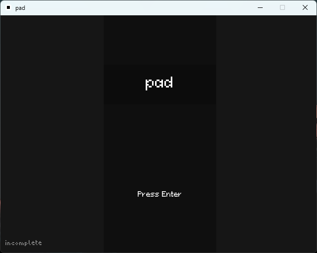

# pad

A simple Breakout/Arkanoid clone made in the [LÖVE](https://www.love2d.org) game engine.

Very incomplete.

## Controls

* A/D: Move paddle
* K: Increase paddle speed when held
* F4: Open debug menu
* P: Pause game
* F (for testing): Trigger game over scene
* Space (for testing): Add 100 points to score
* Down arrow (for testing): Reduce lives by 1

## TODO

* Finish the collision system
* Add ball "physics" functionality
* Add scoring system (finished high score functionality)
* Add lives functionality (partial?)
* Add levels
* Add textures when done (partial)

## Libraries and assets used

### Libraries

* [bump.lua](https://github.com/kikito/bump.lua) for collision functionality
* [cron.lua](https://github.com/kikito/cron.lua/) for timer function

### Assets

* [Micropixel](https://www.dafont.com/micropixel.font?l[]=10) font by [Sebastian Weber](https://www.dafont.com/sebastian-weber.d1791?l[]=10)
* [Pixeloid Sans](https://ggbot.itch.io/pixeloid-font) font by [GGBotNet](https://ggbot.itch.io/)

## License

Licensed under the [MIT License](./LICENSE.md).

