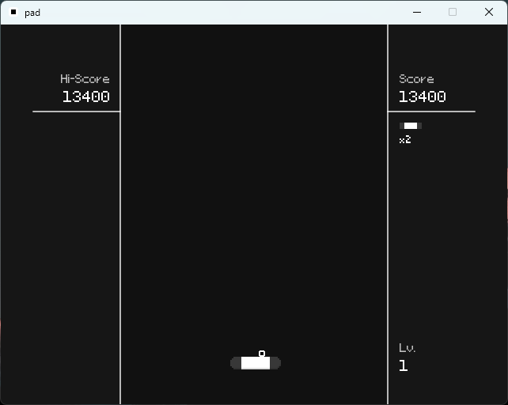
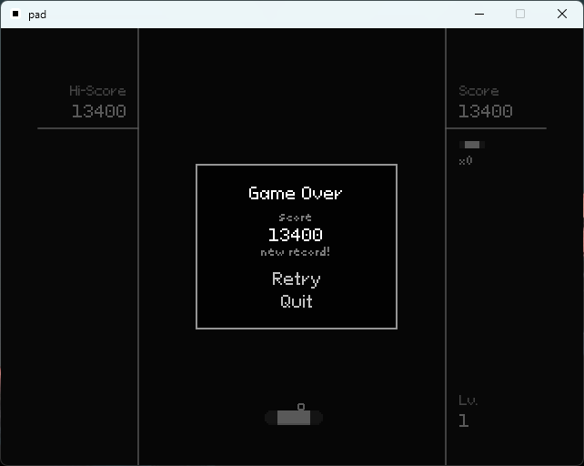

# pad

A simple Breakout clone made in the [LÖVE](https://www.love2d.org) game engine.

Very incomplete.

## Controls

- A/D: Move paddle
- F4: Open debug menu
- F: Trigger game over scene
- Space (for testing purposes): Add 100 points to score

## TODO

- Finish the collision system
- Add ball "physics" functionality
- Add scoring system (finished high score functionality)
- Add lifes functionality
- Add levels
- Add textures when done

## Libraries and assets used

### Libraries
- [bump.lua](https://github.com/kikito/bump.lua) for collision functionality

### Assets
- [Micropixel](https://www.dafont.com/micropixel.font?l[]=10) font by [Sebastian Weber](https://www.dafont.com/sebastian-weber.d1791?l[]=10)
- [Pixeloid Sans](https://ggbot.itch.io/pixeloid-font) font by [GGBotNet](https://ggbot.itch.io/)

## License
Licensed under the [MIT License](./LICENSE).